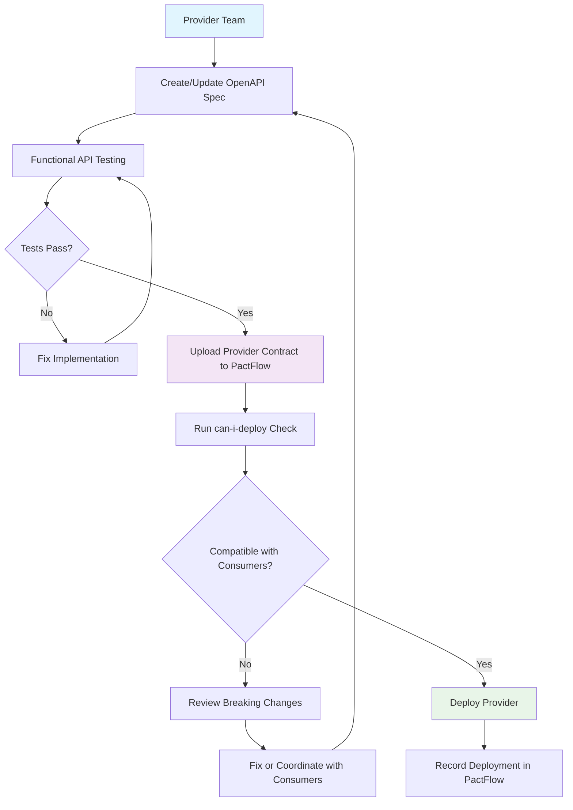
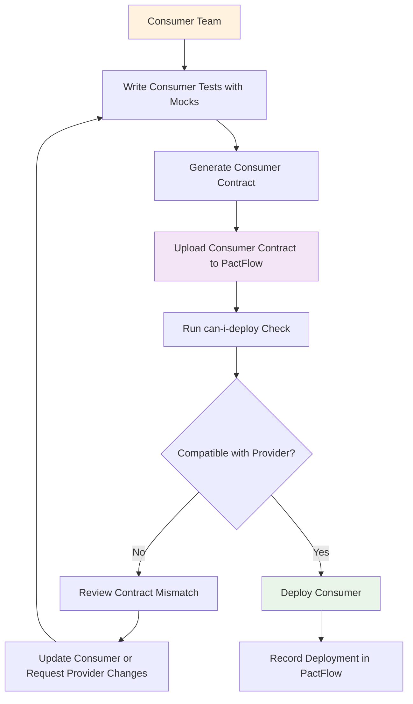
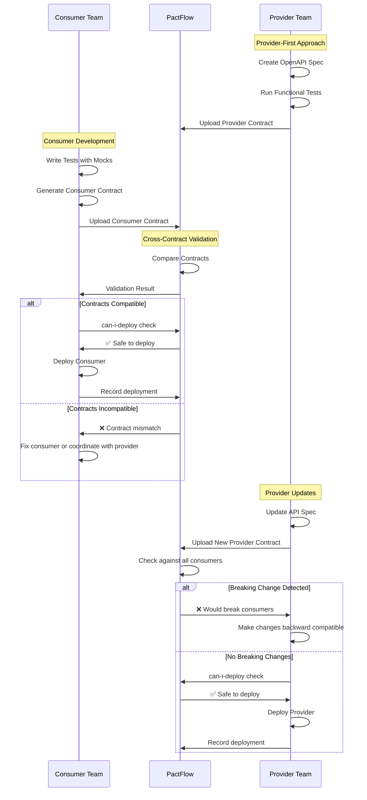
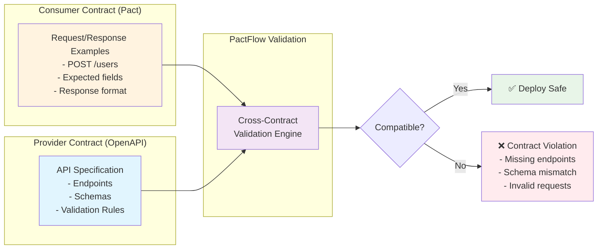

# Bidirectional Contract Testing Guide

## Introduction

Bidirectional Contract Testing (BDCT) is a type of **static contract testing** where two contracts - one representing consumer expectations, and another representing the provider's capability - are compared to ensure they are compatible.

Unlike traditional Pact testing where consumer contracts are replayed against a running provider, BDCT statically compares contracts at the specification level. This creates a simpler and more decoupled workflow that allows teams to "upgrade" their existing tools into a powerful contract-testing solution.

### Key Concepts

- **Consumer Contract**: A collection of interactions that describe how the Consumer expects the Provider to behave (typically a Pact file)
- **Provider Contract**: Specifies the Provider's capability (typically an OpenAPI specification)
- **Cross-contract Validation**: The process by which PactFlow confirms that the consumer contract is a valid subset of a provider contract

### Benefits

- **Faster Implementation**: Reduces contract testing implementation time across your architecture
- **Tool Reuse**: Leverages existing mocking and API testing tools
- **Team Decoupling**: Eliminates the need for coordinated testing between consumer and provider teams
- **Third-party Support**: Can test against external APIs using their published specifications

## When to Use Bidirectional Contract Testing

BDCT is particularly valuable for:

- **Retrofitting** contract testing onto existing systems
- **API Gateways** and pass-through systems
- **Internal APIs** with large numbers of consumers
- **Third-party API testing** where you can't control the provider
- **Contract-first workflows** using OpenAPI specifications
- **Web-based contract tests** (Cypress) that need API compatibility
- **Monolith to microservice migrations**

## Provider Workflow



### Provider Steps

1. **Create Provider Contract**: Start with an OpenAPI specification that defines the API's capabilities
2. **Functional Testing**: Test the provider contract against the actual implementation using tools like:
   - ReadyAPI
   - SoapUI  
   - RestAssured
   - Dredd
   - Postman
3. **Upload Contract**: Publish the provider contract to PactFlow
4. **Compatibility Check**: Run `can-i-deploy` to ensure no consumer contracts are broken
5. **Deploy**: If compatible, deploy the provider and record the deployment

## Consumer Workflow



### Consumer Steps

1. **Mock-based Testing**: Test consumer behavior against mocks using tools like:
   - Pact
   - WireMock
   - MSW (Mock Service Worker)
   - Cypress with mocking
2. **Generate Contract**: Create a consumer contract (Pact file) that captures only the actual interactions
3. **Upload Contract**: Publish the consumer contract to PactFlow
4. **Compatibility Check**: Run `can-i-deploy` to verify the consumer works with the provider contract
5. **Deploy**: If compatible, deploy the consumer and record the deployment

## Complete BDCT Workflow



## Contract Comparison Process



## Key Commands

### Local Contract Comparison
```bash
# Compare OpenAPI spec with consumer contract locally
npx openapi-pact-comparator ./openapi.yaml ./scenario1_consumer_pact.json
```

### Publishing Contracts
```bash
# Publish consumer contract
pact-broker publish ./pacts \
  --consumer-app-version 1.0.0 \
  --branch main

# Publish provider contract  
pactflow publish-provider-contract \
  openapi.yaml \
  --provider-app-version 1.0.0 \
  --branch main
```

### Deployment Safety Checks
```bash
# Check if consumer can deploy
pact-broker can-i-deploy \
  --pacticipant user-consumer \
  --version 1.0.0 \
  --to-environment production

# Check if provider can deploy
pact-broker can-i-deploy \
  --pacticipant user-provider \
  --version 2.0.0 \
  --to-environment production
```

### Recording Deployments
```bash
# Record successful deployment
pact-broker record-deployment \
  --pacticipant user-consumer \
  --version 1.0.0 \
  --environment production
```

## Comparison: Traditional vs BDCT vs Pact

| Aspect | Traditional E2E | Pact (CDC) | Bidirectional Contract Testing |
|--------|----------------|------------|--------------------------------|
| **Approach** | End-to-end testing | Consumer-driven contracts | Specification-based contracts |
| **Guarantees** | ++++ | +++ | + |
| **Maintenance Cost** | -- | ++ | +++ |
| **Learning Curve** | ++++ | - | + |
| **Team Coupling** | -- | + | +++ |
| **Feedback Time** | - | ++ | +++ |
| **Unknown Consumers** | + | - | + |
| **Third-party APIs** | - | - | +++ |

*More `+` is better, more `-` is worse*

## Best Practices

1. **Start Simple**: Begin with critical API endpoints and expand coverage gradually
2. **Automate Everything**: Integrate contract testing into CI/CD pipelines
3. **Version Contracts**: Use semantic versioning for both consumer and provider contracts
4. **Monitor Compatibility**: Set up alerts for contract compatibility issues
5. **Document Changes**: Maintain clear documentation of API changes and their impact
6. **Test Early**: Run contract validation as early as possible in the development cycle

### OpenAPI Schema Design Best Practices

#### additionalProperties Configuration
When designing OpenAPI specifications for bidirectional contract testing, carefully consider the `additionalProperties` setting:

**Recommended Approach: Default to `additionalProperties: true`**
```yaml
# ✅ Recommended - Follows Robustness Principle
CreateUserRequest:
  type: object
  required: [name, email]
  properties:
    name:
      type: string
    email:
      type: string
      format: email
    age:
      type: integer
      minimum: 0
      maximum: 110
  additionalProperties: true  # Be liberal in what you accept
```

**Use `additionalProperties: false` Only When Necessary**
```yaml
# ⚠️ Use sparingly - Only for security or strict business requirements
PaymentRequest:
  type: object
  required: [amount, currency, cardNumber]
  properties:
    amount:
      type: number
    currency:
      type: string
    cardNumber:
      type: string
  additionalProperties: false  # Strict validation for sensitive data
```

#### Why Default to `additionalProperties: true`?

1. **Robustness Principle**: "Be conservative in what you send, be liberal in what you accept"
2. **Forward Compatibility**: Allows consumers to send additional fields without breaking
3. **Gradual Evolution**: Enables incremental API changes without coordination
4. **Reduced Coupling**: Consumers can evolve independently of providers

#### When to Use `additionalProperties: false`

- **Security Requirements**: Sensitive endpoints (payments, authentication)
- **Strict Business Rules**: When additional data could cause business logic issues
- **Performance Concerns**: When processing unknown fields impacts performance
- **Compliance**: When regulatory requirements mandate strict validation

#### Impact on Contract Testing

```yaml
# This configuration affects contract compatibility:
additionalProperties: false
```

**Common Error with `additionalProperties: false`:**
```
Request body is incompatible with the request body schema in the spec file: 
must NOT have additional properties - phoneNumber
```

**Resolution Strategies:**
1. **Provider**: Change to `additionalProperties: true` if business rules allow
2. **Consumer**: Remove additional properties from contract expectations
3. **Coordination**: Add the property to the OpenAPI specification if it should be supported

## Conclusion

Bidirectional Contract Testing provides a pragmatic approach to contract testing that leverages existing tools and processes. It's particularly valuable for organizations looking to retrofit contract testing onto existing systems or those working with third-party APIs where traditional Pact testing isn't feasible.

The key advantage is the decoupling of teams - providers and consumers can work independently while maintaining confidence that their integrations will work correctly in production.

## Next Steps

- **Implementation**: Start with [Consumer Testing Best Practices](spring_boot_consumer_testing_best_practices.md) or [Provider Testing Best Practices](spring_boot_provider_testing_best_practices.md)
- **Troubleshooting**: Reference [Compatibility Checks Guide](pactflow_compatibility_checks_reference.md) when issues arise
- **Examples**: Review [Test Scenarios](pactflow_test_scenarios.md) for real-world examples

## Related Documentation

- [Spring Boot Consumer Testing Best Practices](spring_boot_consumer_testing_best_practices.md) - Consumer implementation guide
- [Spring Boot Provider Testing Best Practices](spring_boot_provider_testing_best_practices.md) - Provider implementation guide
- [PactFlow Compatibility Checks Reference](pactflow_compatibility_checks_reference.md) - Troubleshooting reference
- [PactFlow Test Scenarios](pactflow_test_scenarios.md) - Real-world testing scenarios