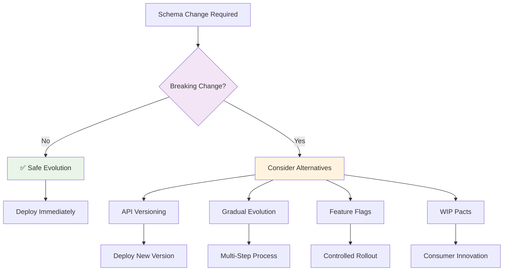

# Schema Evolution with Bidirectional Contracts

## Overview

Schema evolution in bidirectional contract testing requires careful planning to maintain compatibility between provider OpenAPI specifications and consumer contracts. Unlike traditional consumer-driven contract testing, the **provider's OpenAPI specification serves as the source of truth**, and consumers must adapt to provider capabilities.

This guide covers strategies for evolving API schemas while maintaining contract compatibility and deployment safety.

## Core Principles

### Specification-First Evolution
- **Provider OpenAPI spec is authoritative** - defines what's possible
- **Consumer contracts must be subsets** - can only use what provider offers
- **Backward compatibility is crucial** - avoid breaking existing consumers
- **Gradual evolution is preferred** - incremental changes over breaking changes

### Evolution vs Breaking Changes


## Safe Evolution Patterns

### 1. Adding Optional Fields

**✅ Safe - Backward Compatible**

**Step 1: Add optional field to OpenAPI spec**
```yaml
# Before
CreateUserRequest:
  type: object
  required: [name, email]
  properties:
    name: { type: string }
    email: { type: string }

# After - Safe Evolution
CreateUserRequest:
  type: object
  required: [name, email]  # No change to required fields
  properties:
    name: { type: string }
    email: { type: string }
    department: { type: string }  # ✅ Optional field added
```

**Step 2: Existing consumer contracts continue to work**
```json
// Existing consumer contract - still valid
{
  "request": {
    "method": "POST",
    "path": "/users",
    "body": {
      "name": "John Doe",
      "email": "john@example.com"
      // No department field - still works!
    }
  }
}
```

**Step 3: New consumers can use the optional field**
```java
// New consumer test can include department
@Pact(consumer = "new-consumer")
public RequestResponsePact createUserWithDepartmentPact(PactDslWithProvider builder) {
    return builder
        .given("user creation accepts department")
        .uponReceiving("a request to create user with department")
        .path("/users")
        .method("POST")
        .body(new PactDslJsonBody()
            .stringType("name", "Jane Doe")
            .stringType("email", "jane@example.com")
            .stringType("department", "Engineering"))  // ✅ New optional field
        .willRespondWith()
        .status(201)
        .body(new PactDslJsonBody()
            .uuid("id")
            .stringType("name", "Jane Doe")
            .stringType("email", "jane@example.com")
            .stringType("department", "Engineering"))
        .toPact();
}
```

### 2. Adding Response Fields

**✅ Safe - Consumers ignore unknown fields**

```yaml
# Adding fields to response is always safe
UserResponse:
  type: object
  properties:
    id: { type: string }
    name: { type: string }
    email: { type: string }
    createdAt: { type: string }  # ✅ New response field - safe to add
    lastLoginAt: { type: string }  # ✅ Another new field - safe
```

**Consumer contracts automatically ignore new response fields:**
```json
// Consumer contract only expects what it needs
{
  "response": {
    "status": 201,
    "body": {
      "id": "123",
      "name": "John Doe",
      "email": "john@example.com"
      // Consumer ignores createdAt and lastLoginAt
    }
  }
}
```

### 3. Relaxing Validation Rules

**✅ Safe - More permissive is backward compatible**

```yaml
# Before - Strict validation
CreateUserRequest:
  properties:
    age:
      type: integer
      minimum: 18  # Strict: only adults
      maximum: 65

# After - Relaxed validation
CreateUserRequest:
  properties:
    age:
      type: integer
      minimum: 0   # ✅ More permissive
      maximum: 120 # ✅ More permissive
```

## Gradual Evolution Patterns

### 1. Optional → Required Field Evolution

**Multi-step process to avoid breaking changes:**

**Step 1: Add as optional field**
```yaml
CreateUserRequest:
  type: object
  required: [name, email]
  properties:
    name: { type: string }
    email: { type: string }
    department: { type: string }  # Optional initially
```

**Step 2: Consumers gradually adopt the field**
```java
// Consumer teams update their contracts over time
@Pact(consumer = "frontend-app")
public RequestResponsePact createUserWithDepartmentPact(PactDslWithProvider builder) {
    return builder
        .uponReceiving("a request to create user with department")
        .body(new PactDslJsonBody()
            .stringType("name", "John Doe")
            .stringType("email", "john@example.com")
            .stringType("department", "Engineering"))  // ✅ Now included
        .toPact();
}
```

**Step 3: Monitor adoption**
```bash
# Check which consumers are using the new field
pact-broker can-i-deploy \
  --pacticipant user-service \
  --version 2.0.0 \
  --to-environment production \
  --dry-run
```

**Step 4: Make field required (after all consumers adopt)**
```yaml
CreateUserRequest:
  type: object
  required: [name, email, department]  # ✅ Now required
  properties:
    name: { type: string }
    email: { type: string }
    department: { type: string }
```

### 2. Enum Value Evolution

**Adding enum values is safe, removing requires care:**

**✅ Safe: Adding enum values**
```yaml
# Before
department:
  type: string
  enum: [Engineering, Marketing, Sales]

# After - Safe addition
department:
  type: string
  enum: [Engineering, Marketing, Sales, HR, Finance]  # ✅ Added values
```

**⚠️ Careful: Removing enum values**
```yaml
# Dangerous - could break consumers expecting "Marketing"
department:
  type: string
  enum: [Engineering, Sales, HR, Finance]  # ❌ Removed "Marketing"
```

**Better approach for enum removal:**
1. **Deprecation period**: Mark values as deprecated in documentation
2. **Monitor usage**: Check which consumers use deprecated values
3. **Coordinate removal**: Work with consumer teams to update
4. **Gradual removal**: Remove after all consumers updated

## API Versioning Strategies

### 1. URL Path Versioning

**When to use**: Major breaking changes that can't be evolved gradually

```yaml
# Version 1 API
paths:
  /v1/users:
    post:
      requestBody:
        content:
          application/json:
            schema:
              $ref: '#/components/schemas/CreateUserRequestV1'

# Version 2 API - Breaking changes
paths:
  /v2/users:
    post:
      requestBody:
        content:
          application/json:
            schema:
              $ref: '#/components/schemas/CreateUserRequestV2'

components:
  schemas:
    CreateUserRequestV1:
      type: object
      required: [name, email]
      properties:
        name: { type: string }
        email: { type: string }
    
    CreateUserRequestV2:
      type: object
      required: [name, email, department]  # Breaking: new required field
      properties:
        name: { type: string }
        email: { type: string }
        department: { type: string }
```

**Consumer contract evolution:**
```java
// Old consumers continue using v1
@Pact(consumer = "legacy-app")
public RequestResponsePact createUserV1Pact(PactDslWithProvider builder) {
    return builder
        .uponReceiving("a request to create user via v1 API")
        .path("/v1/users")  // ✅ Still works
        .method("POST")
        .body(new PactDslJsonBody()
            .stringType("name", "John Doe")
            .stringType("email", "john@example.com"))
        .toPact();
}

// New consumers use v2
@Pact(consumer = "new-app")
public RequestResponsePact createUserV2Pact(PactDslWithProvider builder) {
    return builder
        .uponReceiving("a request to create user via v2 API")
        .path("/v2/users")  // ✅ New version
        .method("POST")
        .body(new PactDslJsonBody()
            .stringType("name", "Jane Doe")
            .stringType("email", "jane@example.com")
            .stringType("department", "Engineering"))  // Required in v2
        .toPact();
}
```


## WIP Pacts for Consumer Innovation

### Consumer-Driven Schema Proposals

**Scenario**: Consumer wants to propose new API capabilities

```java
// Consumer creates WIP pact for desired functionality
@ExtendWith(PactConsumerTestExt.class)
@PactTestFor(providerName = "user-service", pactVersion = PactSpecVersion.V3)
@TestPropertySource(properties = {"pact.consumer.tags=wip"})
class UserPreferencesWipTest {
    
    @Pact(consumer = "frontend-app")
    public RequestResponsePact getUserPreferencesPact(PactDslWithProvider builder) {
        return builder
            .given("user preferences endpoint will be available")
            .uponReceiving("a request to get user preferences")
            .path("/users/{userId}/preferences")  // ❌ Doesn't exist in OpenAPI yet
            .method("GET")
            .willRespondWith()
            .status(200)
            .body(new PactDslJsonBody()
                .stringType("theme", "dark")
                .booleanType("emailNotifications", true)
                .stringType("language", "en"))
            .toPact();
    }
}
```

**Publishing WIP pact:**
```bash
# Consumer publishes WIP pact - won't break provider builds
pact-broker publish ./pacts \
  --consumer-app-version 1.5.0-feature-preferences \
  --branch feature/user-preferences \
  --tag wip
```

**Provider response workflow:**
1. **Review WIP pact**: Provider team sees consumer requirement
2. **Evaluate feasibility**: Determine if feature aligns with roadmap
3. **Plan implementation**: Add to sprint if approved
4. **Update OpenAPI spec**: Add new endpoint
5. **Implement feature**: Build the actual functionality
6. **Consumer removes WIP**: Contract becomes standard validation

## Feature Flags for Schema Evolution

### Gradual Schema Rollout

```yaml
# OpenAPI spec with feature flag support
CreateUserRequest:
  type: object
  required: [name, email]
  properties:
    name: { type: string }
    email: { type: string }
    department:
      type: string
      description: "Available when feature flag 'user-departments' is enabled"
```

**Provider implementation with feature flags:**
```java
@RestController
public class UserController {
    
    @Autowired
    private FeatureFlagService featureFlags;
    
    @PostMapping("/users")
    public ResponseEntity<UserResponse> createUser(@RequestBody CreateUserRequest request) {
        // Validate department field based on feature flag
        if (featureFlags.isEnabled("user-departments")) {
            // Department field is processed
            validateDepartment(request.getDepartment());
        } else {
            // Department field is ignored for now
            request.setDepartment(null);
        }
        
        User user = userService.createUser(request);
        return ResponseEntity.status(201).body(toResponse(user));
    }
}
```

**Consumer contract testing with feature flags:**
```java
// Test with feature flag enabled
@Test
@PactTestFor(pactMethod = "createUserWithDepartmentPact")
void shouldCreateUserWithDepartmentWhenFeatureEnabled(MockServer mockServer) {
    // Simulate feature flag enabled environment
    System.setProperty("feature.user-departments", "true");
    
    UserServiceClient client = new UserServiceClient(mockServer.getUrl());
    CreateUserRequest request = new CreateUserRequest("John", "john@example.com", "Engineering");
    
    UserResponse response = client.createUser(request);
    assertThat(response.getDepartment()).isEqualTo("Engineering");
}
```

## Breaking Change Management

### 1. Communication Strategy

**Before making breaking changes:**
1. **Announce changes**: Notify all consumer teams
2. **Provide timeline**: Give adequate migration time
3. **Offer support**: Help consumer teams with updates
4. **Monitor adoption**: Track which consumers have updated

### 2. Deprecation Process

```yaml
# OpenAPI spec with deprecation
CreateUserRequest:
  type: object
  properties:
    name: { type: string }
    email: { type: string }
    phone:
      type: string
      deprecated: true  # ✅ Mark as deprecated
      description: "DEPRECATED: Use phoneNumber instead"
    phoneNumber:
      type: string
      description: "Replaces deprecated 'phone' field"
```

**Deprecation timeline:**
- **Week 1-2**: Add new field, mark old field as deprecated
- **Week 3-8**: Consumer teams migrate to new field
- **Week 9**: Remove deprecated field from OpenAPI spec
- **Week 10**: Deploy breaking change

### 3. Emergency Breaking Changes (Pending Pacts)

**⚠️ Last Resort Only**

When immediate breaking changes are unavoidable:

```bash
# Provider enables pending mode for emergency deployment
pact-broker can-i-deploy \
  --pacticipant user-service \
  --version 2.0.0-emergency \
  --to-environment production \
  --enable-pending \
  --provider-tags main
```

**Why this should be avoided:**
- Goes against specification-first principles
- Creates technical debt
- Requires immediate consumer coordination
- Can cause production issues

**Better alternatives:**
- Feature flags for immediate rollback
- API versioning for parallel support
- Gradual evolution with monitoring

## Backward Compatibility Techniques

### 1. Additive Changes Only

**✅ Always Safe:**
- Adding optional request fields
- Adding response fields
- Adding new endpoints
- Relaxing validation rules
- Adding enum values

**❌ Breaking Changes:**
- Adding required request fields
- Removing request/response fields
- Changing field types
- Tightening validation rules
- Removing enum values

### 2. Default Values Strategy

```yaml
# Use defaults to maintain compatibility
CreateUserRequest:
  type: object
  required: [name, email]
  properties:
    name: { type: string }
    email: { type: string }
    department:
      type: string
      default: "General"  # ✅ Default prevents breaking change
```

### 3. Polymorphic Responses

```yaml
# Support multiple response formats
UserResponse:
  oneOf:
    - $ref: '#/components/schemas/UserResponseV1'  # Legacy format
    - $ref: '#/components/schemas/UserResponseV2'  # New format
```

## Monitoring and Validation

### 1. Contract Compatibility Monitoring

```bash
# Regular compatibility checks
pact-broker can-i-deploy \
  --pacticipant user-service \
  --version latest \
  --to-environment production \
  --retry-while-unknown 30 \
  --retry-interval 10
```

### 2. Schema Evolution Metrics

Track evolution success:
- **Contract compatibility rate**: Percentage of passing contracts
- **Breaking change frequency**: How often breaking changes occur
- **Migration time**: How long consumers take to adapt
- **WIP pact resolution time**: Time from WIP to implementation

### 3. Automated Validation

```java
// Automated test to ensure backward compatibility
@Test
void shouldMaintainBackwardCompatibility() {
    // Load previous OpenAPI spec version
    OpenAPI previousSpec = loadOpenAPISpec("v1.0.0");
    OpenAPI currentSpec = loadOpenAPISpec("v2.0.0");
    
    // Validate backward compatibility
    CompatibilityResult result = OpenAPICompatibilityValidator
        .validate(previousSpec, currentSpec);
    
    assertThat(result.getBreakingChanges()).isEmpty();
}
```

## Best Practices Summary

### ✅ Do:
1. **Plan evolution carefully** - Consider impact on all consumers
2. **Use gradual evolution** - Optional → Required field progression
3. **Communicate changes early** - Give consumers time to adapt
4. **Monitor compatibility** - Regular contract validation
5. **Use WIP pacts** - For consumer innovation and requirements
6. **Version APIs** - For major breaking changes
7. **Provide defaults** - To maintain backward compatibility
8. **Test thoroughly** - Validate all evolution scenarios

### ❌ Don't:
1. **Make sudden breaking changes** - Always plan migration path
2. **Ignore consumer impact** - Consider all downstream effects
3. **Rush deprecations** - Give adequate migration time
4. **Rely on pending pacts** - Use as emergency option only
5. **Skip communication** - Always notify affected teams
6. **Forget monitoring** - Track compatibility continuously
7. **Ignore WIP feedback** - Consumer innovation drives value
8. **Break semantic versioning** - Follow versioning standards

## Conclusion

Schema evolution in bidirectional contract testing requires balancing provider autonomy with consumer stability. The specification-first approach gives providers control over API evolution while ensuring consumers can adapt safely.

Key success factors:
- **Gradual evolution over breaking changes**
- **Clear communication and coordination**
- **Proper use of WIP pacts for innovation**
- **Monitoring and validation throughout the process**
- **Emergency procedures for unavoidable breaking changes**

By following these patterns and practices, teams can evolve their APIs confidently while maintaining the benefits of bidirectional contract testing.

## Related Documentation

- [Bidirectional Contract Testing Guide](bidirectional_contract_testing_guide.md) - Core concepts and workflow
- [Spring Boot Consumer Testing Best Practices](spring_boot_consumer_testing_best_practices.md) - Consumer implementation with WIP pacts
- [Spring Boot Provider Testing Best Practices](spring_boot_provider_testing_best_practices.md) - Provider testing and validation
- [PactFlow Compatibility Checks Reference](pactflow_compatibility_checks_reference.md) - Troubleshooting schema compatibility issues